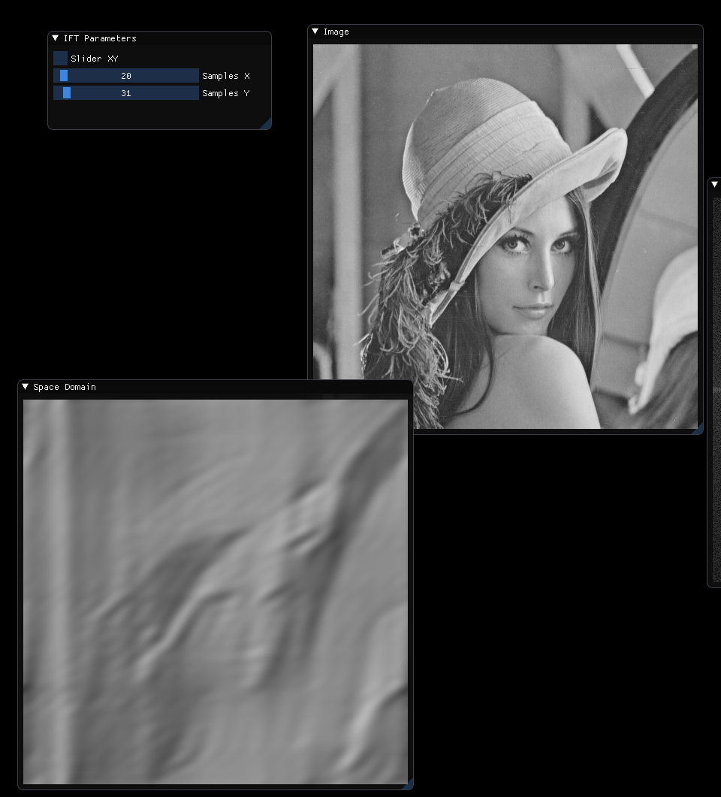

# FFTViewer

2D Fourier Transform Viewer



## Requirements
* [fftw](http://www.fftw.org/)

## Build

```
mkdir build
cd build
cmake ..
make -j2
```

## Externals

* [GLFW3](https://github.com/glfw/glfw) - Zlib License.
* [Dear ImGui](https://github.com/ocornut/imgui) - MIT License.
* [stb](https://github.com/nothings/stb) - Public Domain License.
* [fftw](http://www.fftw.org/) - FFTW License.
